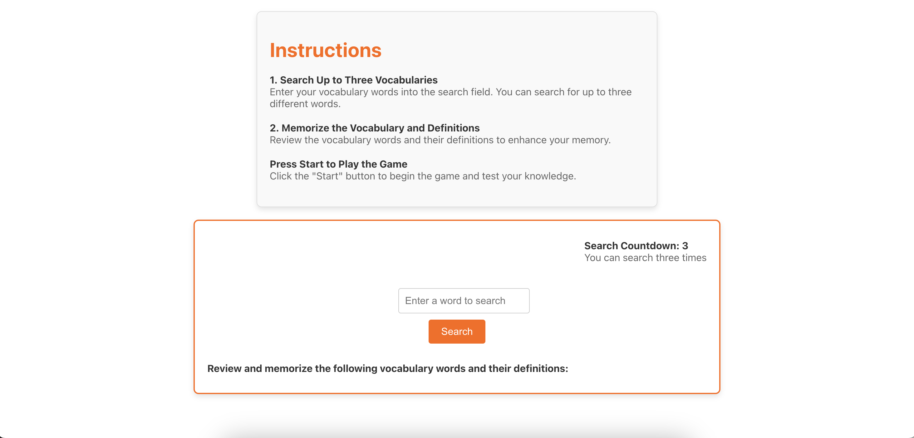

# FLIP_REACT

FLIP_REACT is an enhanced version of [FLIP](https://github.com/loafcheck/FLIP), incorporating advanced features and improvements. Leveraging React.js, this application integrates the [Korean Dictionary OpenAPI](https://krdict.korean.go.kr/openApi/openApi) to deliver an enriched user experience.

## Features

### 1. **OpenAPI Integration**
   - **API Usage**: Integrated with the [Korean Dictionary OpenAPI](https://krdict.korean.go.kr/openApi/openApi) to enhance card content and provide additional functionality.

### 2. **Game State Management**
   - **State Handling**: Efficiently manages game state using React hooks.
   - **Asynchronous Updates**: Handles asynchronous state updates to ensure smooth and responsive gameplay.

### 3. **Card Flipping Mechanism**
   - **Interactive Gameplay**: Click on cards to flip them and reveal their contents.
   - **Matching Logic**: Automatically detects and highlights matching card pairs.
   - **Visual Feedback**: Provides visual cues and feedback when cards are matched or flipped.

### 4. **Responsive Design**
   - **Mobile-Friendly**: Optimized for a smooth experience on mobile devices.
   - **Adaptive Layout**: Adjusts the layout based on screen size and orientation.

## Game Overview

### 1. **Instruction**
*Get started with the game by following the instructions provided.*
   
   

---

### 2. **Dictionary**
*Search Korean vocabulary using the [Korean Dictionary OpenAPI](https://krdict.korean.go.kr/openApi/openApi).*
   
   

---

### 3. **Game**
*Play the flip game where you reveal cards and try to find matching pairs.*
   
   

---

### 4. **Win**
  *Once all cards are matched, a congratulatory message will pop up.*
   
   

---